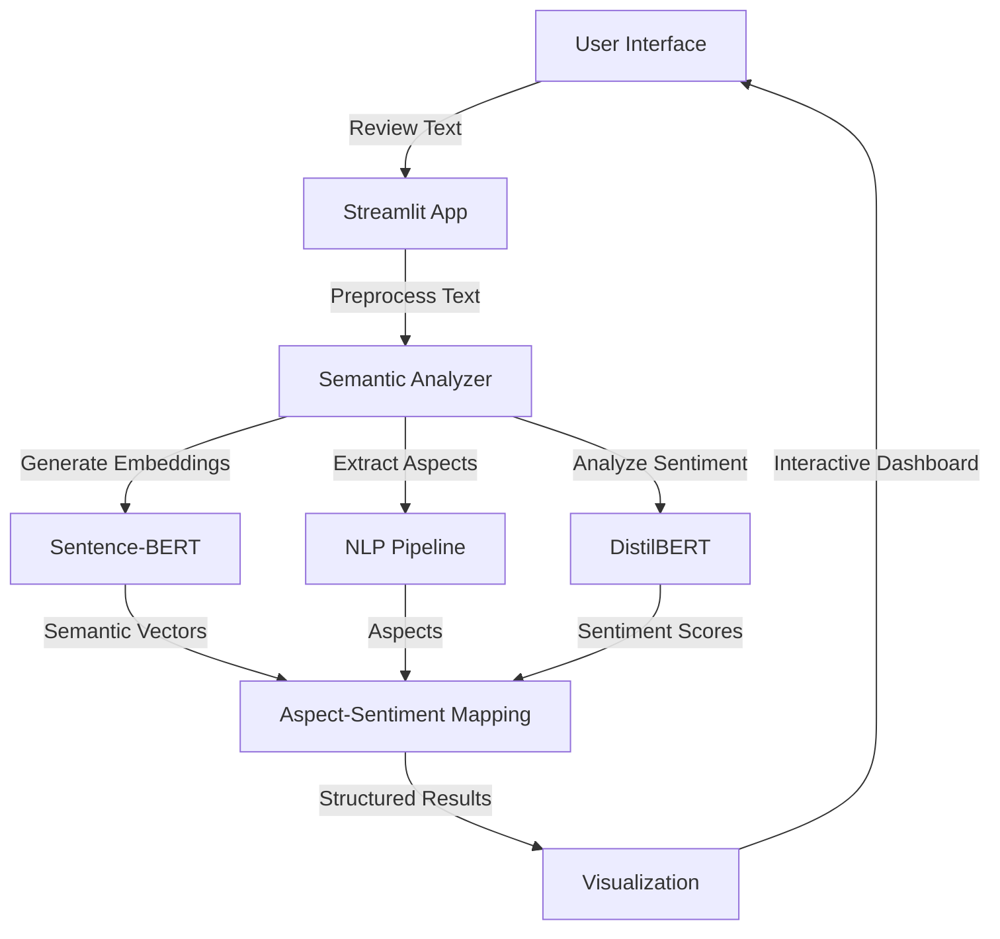

# Semantic Product Review Analyzer - Technical Specification

## 1. System Architecture



## 2. System Components

### 2.1 Frontend
- **Framework**: Streamlit
- **Key Features**:
  - Interactive text input for product reviews
  - Real-time processing feedback
  - Responsive visualization components
  - Mobile-friendly interface

### 2.2 Backend
- **Core Libraries**:
  - Sentence-Transformers (all-MiniLM-L6-v2) for semantic embeddings
  - Transformers (DistilBERT) for sentiment analysis
  - spaCy for NLP processing
  - NLTK for text preprocessing

### 2.3 Data Flow
1. User submits a product review through the Streamlit interface
2. Text is preprocessed (tokenization, stopword removal, lemmatization)
3. Semantic embeddings are generated using Sentence-BERT
4. Key aspects are extracted using NLP techniques
5. Sentiment is analyzed for each aspect
6. Results are formatted and returned to the UI

## 3. Dataset

### 3.1 Recommended Datasets
1. **Amazon Fine Food Reviews**
   - Source: [Kaggle](https://www.kaggle.com/snap/amazon-fine-food-reviews)
   - Size: ~500,000 reviews
   - Fields: Text, Score, Summary

2. **Sample Dataset (Included)**
   - Location: `data/sample_reviews.csv`
   - Format:
     ```csv
     review_text,rating
     "Great battery life but camera could be better",4
     "The display is amazing and very bright",5
     "Poor sound quality and expensive",2
     ```

## 4. Model Specifications

### 4.1 Sentence-BERT (all-MiniLM-L6-v2)
- **Input**: Raw text (up to 512 tokens)
- **Output**: 384-dimensional vector
- **Purpose**: Semantic understanding and similarity

### 4.2 DistilBERT (fine-tuned on SST-2)
- **Input**: Preprocessed text
- **Output**: Sentiment probabilities (positive/negative/neutral)
- **Accuracy**: ~91% on SST-2

## 5. Performance Metrics

| Metric | Value | Description |
|--------|-------|-------------|
| Processing Time | < 2s | Average time to analyze a review |
| Aspect Accuracy | ~85% | Accuracy of aspect extraction |
| Sentiment F1 | 0.89 | Weighted F1 score for sentiment |
| Max Review Length | 1000 chars | Maximum supported review length |

## 6. API Endpoints (Internal)

### 6.1 Analyze Review
```
POST /api/analyze
{
    "review_text": "The camera is great but battery drains quickly"
}

Response:
{
    "review": "The camera is great but battery drains quickly",
    "overall_sentiment": {
        "label": "mixed",
        "score": 0.72
    },
    "aspects": [
        {
            "aspect": "camera",
            "mentions": ["camera"],
            "sentiment": {
                "label": "positive",
                "score": 0.92
            }
        },
        {
            "aspect": "battery",
            "mentions": ["battery"],
            "sentiment": {
                "label": "negative",
                "score": 0.85
            }
        }
    ]
}
```

## 7. Error Handling

| Error Code | Description | Resolution |
|------------|-------------|------------|
| 400 | Invalid input format | Check JSON payload |
| 413 | Review too long | Limit review to 1000 characters |
| 422 | Unprocessable content | Check review text format |
| 500 | Internal server error | Check server logs |

## 8. Deployment

### 8.1 Local Development
```bash
# Install dependencies
pip install -r requirements.txt

# Download NLTK data
python -c "import nltk; nltk.download('punkt'); nltk.download('stopwords'); nltk.download('wordnet')"

# Download spaCy model
python -m spacy download en_core_web_sm

# Run the application
streamlit run app.py
```

### 8.2 Cloud Deployment
1. **Containerization**:
   ```dockerfile
   FROM python:3.9-slim
   COPY . /app
   WORKDIR /app
   RUN pip install -r requirements.txt && \
       python -m nltk.downloader punkt stopwords wordnet && \
       python -m spacy download en_core_web_sm
   EXPOSE 8501
   CMD ["streamlit", "run", "app.py"]
   ```

2. **Deployment Options**:
   - AWS Elastic Beanstalk
   - Google App Engine
   - Azure App Service
   - Heroku

## 9. Testing

### 9.1 Unit Tests
```bash
pytest tests/
```

### 9.2 Test Coverage
```bash
pytest --cov=src tests/
```

## 10. Future Enhancements

1. **Multi-language Support**
   - Add support for multiple languages using multilingual BERT
   - Implement language detection

2. **Advanced Analytics**
   - Sentiment trend analysis over time
   - Competitor comparison
   - Feature importance analysis

3. **API Expansion**
   - Batch processing endpoint
   - Webhook support for async processing
   - Rate limiting and API keys

4. **Performance Optimization**
   - Model quantization for faster inference
   - Caching frequent queries
   - Async processing for long reviews

## 11. License

This project is licensed under the MIT License - see the [LICENSE](LICENSE) file for details.

## 12. Contact

For support or queries, please contact [your-email@example.com](mailto:your-email@example.com)
